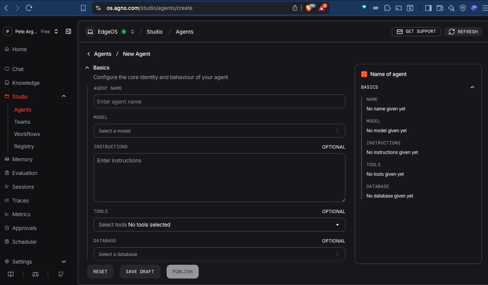

# Agno AgentOS

[Agno AgentOS](https://docs.agno.com/agent-os/introduction) is an open-source framework for building and deploying intelligent agents. It provides a modular architecture that allows developers to create agents with various capabilities, such as natural language processing, decision-making, and learning.


## What you get

1. **AgentOS**: A powerful framework for building and deploying intelligent agents.
2. **Registry**: A centralized place to manage your agents, tools, models, and databases.
3. **Tools**: A collection of tools that agents can use to interact with the world, such as web search, Hacker News, and more.
4. **Models**: A variety of models that agents can use for natural language processing, decision-making, and learning.
5. **Databases**: Support for various databases to store and manage agent data.
6. **Studio**: A user-friendly interface for managing your agents, teams, and workflows

## Features

- **Docker with a postgresql database**: Easily set up your environment with Docker, including a PostgreSQL database for storing agent data.
- **Temporary keys**: Get started quickly with temporary API keys for OpenAI and Ollama. You'll need to replace these with your own keys after the demo.


## Getting Started

To get started with Agno AgentOS, follow these steps:

### 1. Install Docker

If you don't have Docker installed, you can download it from the [Docker website](https://www.docker.com/get-started/). Follow the installation instructions for your operating system.

Start Docker Desktop after installation and ensure it's running before proceeding to the next steps.

### 2. Open your terminal

On Windows, PowerShell or Command Prompt will work. 
On macOS, you can use the Terminal application.

### 3. Clone the repository

This downloads the code for the demo to your local machine.

```bash
git clone https://github.com/pedrogrande/vibehack-agentos.git
cd vibehack-agentos
```

### 4. Set up python environment

It's recommended to use a virtual environment to manage your Python dependencies. We'll use `uv` for this, which is a modern Python tool that combines the functionalities of `pip` and `venv`.

https://docs.astral.sh/uv/getting-started/installation/

**Windows in Powershell**:

```bash
powershell -ExecutionPolicy ByPass -c "irm https://astral.sh/uv/install.ps1 | iex"
```

**MacOS**:

```bash
curl -LsSf https://astral.sh/uv/install.sh | sh
```

You can install it using pip:

```bash
pip install uv
```

You can create and activate a virtual environment using the following commands:

```bash
uv venv
source .venv/bin/activate
```

### 5. Install python packages

These are the dependencies required to run the demo. You can install them using `uv pip`.

```bash
uv pip install -U fastapi uvicorn sqlalchemy pgvector psycopg chromadb openai mcp agno ollama registry ddgs
```

### 6. Set up environment variables

These API keys are required for the demo to work. You can get temporary keys for OpenAI and Ollama from your facilitator, but you'll need to replace them with your own keys after the demo.

```bash
export OPENAI_API_KEY=sk-proj-openai-key
export OLLAMA_API_KEY=ollama_key
```

### 7. Create the PostgreSQL database

This database will be used to store agent data. You can set it up using Docker with the following command:

```bash
docker run -d \
  --name agno-postgres \
  -e POSTGRES_DB=ai \
  -e POSTGRES_USER=ai \
  -e POSTGRES_PASSWORD=ai \
  -p 5532:5432 \
  pgvector/pgvector:pg17
```

Check the Docker Desktop application to ensure the container is running. You should see a container named `agno-postgres` in the list of running containers.

### 8. Run the demo

Now you can start the demo application. This will set up the agents, tools, models, and registry as defined in `demo.py`.

```bash
python demo.py
```

### 9. Access the AgentOS

Docs: https://docs.agno.com/agent-os/connect-your-os


Open your web browser and navigate to `https://os.agno.com/`. You'll need to register for an account if you don't have one already. 

Once you're logged in, you can add your own AgentOS. Click on "Add AgentOS" and fill in the details. For the "API URL", use `http://localhost:8000` and give your OS a name eg "Pete's Agents". 



## Links

**Agno docs:**
- https://docs.agno.com/agent-os/usage/demo
- https://docs.agno.com/agent-os/studio/introduction


**Docker:**
- https://www.docker.com/get-started/
- https://docs.docker.com/desktop/setup/install/windows-install/

**Models:**
- https://ollama.com/library/glm-4.7-flash
- https://ollama.com/library/gemma4
- https://developers.openai.com/api/docs/guides/embeddings